 

  

<h3><code>nicholas@github ~ $ ./contributions.sh</code></h3>

  

<h3><code>nicholas@github ~ $ whoami</code></h3>

<!--
  ASCII PORTRAIT — turn this on after you generate ascii-portrait.svg locally.
  Steps (run once, on your own machine):
    pip install -r scripts/requirements.txt
    python scripts/prep_photo.py your-photo.jpg
    python scripts/make_ascii_svg.py
  Then DELETE the single  line above and
  UNCOMMENT the table below for the side-by-side portrait + card layout:

  <table>
    <tr>
      <td valign="top"></td>
      <td valign="top"></td>
    </tr>
  </table>
-->

---

## Featured Projects

| Project | What It Is | Stack |
| :--- | :--- | :--- |
| **[Deadly Desert Drive](https://github.com/Nicholas69-69/Deadly_Desert_Drive)** | A desert driving survival game focused on vehicle handling, hazard avoidance and atmosphere. | `Unity` `ShaderLab` `C#` |
| **[Desert Road Runner](https://github.com/Nicholas69-69/DesertRoadRunner-GADE6221)** | Endless-runner style desert driving prototype — spawning, scoring and obstacle systems. | `Unity` `C#` |
| **[First-Person Shooter](https://github.com/Nicholas69-69/Firstperson-Shooter)** | FPS sandbox exploring weapon handling, raycast shooting and player controller feel. | `Unity` `C#` |
| **[GADE6221 — POE](https://github.com/Nicholas69-69/GADE6221--POE)** | Portfolio of Evidence project covering core game development coursework. | `Unity` `C#` |
| **[ClipFlow](https://github.com/Nicholas69-69/clipflow)** | A utility project outside of game dev — building tooling for clip workflows. | `C#` |
| **[Unity Test](https://github.com/Nicholas69-69/Unity-test)** | Prototyping sandbox for testing mechanics, packages and engine features. | `Unity` |

  

---

## Connect With Me

---

*"Ship the prototype. Then make it feel good."*

<!--
  The contribution graph above is a self-generated SVG committed to this repo
  (no third-party stats service, no token) and refreshed daily by
  .github/workflows/update-profile-art.yml. See scripts/ for the pipeline.
-->
